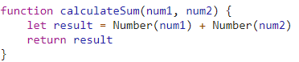

### Part 3
Question 1: The bug was that the program takes in the inputs as text, and "adds" them as text, instead of as numbers. It should convert the input to numbers and then add, because adding them as strings just results in concatenation.

Question 2: I would fix it by wrapping the uses of <code>num1</code> and <code>num2</code> in a <code>Number()</code> cast, like so:

Question 3: <code>citylots.json</code>

Question 4: <code>part2.js</code>

Question 5: 11.7MB

Question 6: 72ms

Question 7: Mozilla/5.0 (Windows NT 10.0; Win64; x64) AppleWebKit/537.36 (KHTML, like Gecko) Chrome/90.0.4430.85 Safari/537.36

Question 8: Apache

Question 9: Tue, 26 Jan 2021 22:14:13 GMT

Question 10: application/json

Question 11: <code>fetchData</code>